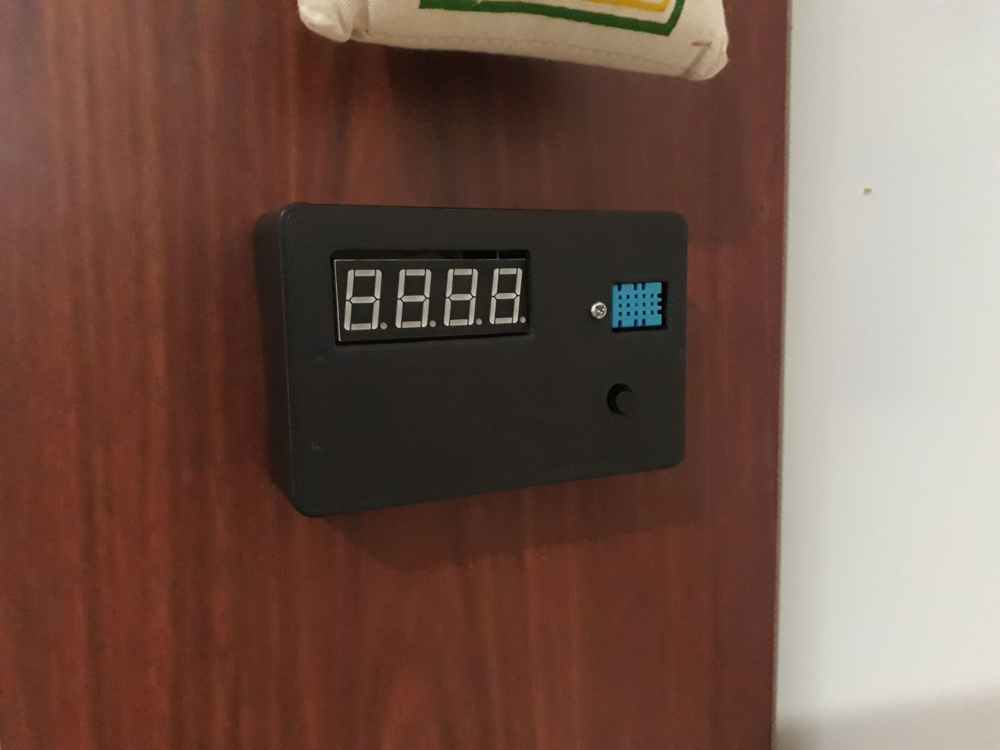

# Digital Thermometer

Arduino code for a digital thermometer (temperature, humidity and heat index) with auto-OFF functionality.

&nbsp;

This project use the following electronic components:
- 1 x Arduino UNO / Nano v3
- 1 x DHT11 temperature/humidity sensor
- 1 x Display 5461AS, 7 segment, 4 digit, common anode
- 8 x 1k ohm resistors
- 1 x 10k ohm resistor
- 1 x Transistor BC547 NPN
- 1 x Electrolitic capacitor 470uF 10v
- 1 x Push-button
- 1 x Batery 9v

The circuit:
- Pressing the push-button charges the capacitor and puts the transistor in conducting state.
- After the button is released, the capacitor continues to power the base of the transistor for around 20 seconds.
- The current through the transistor powers the Arduino (and rest of the thermometer).
- Arduino constrols the temperature+humidity measurement and the multiplexing process for the 4 digit display.

Notes:
- This thermometer automatically turns off approximately 20 seconds after activation.
- To increase this time, change the capacitor to one of higher capacitance.
- Edit `Definitions.h` to adjust configured display pins to your own display model.

&nbsp;

### Screenshots

| Schematics Diagram                              | PCB Layout                                      |
|-------------------------------------------------|-------------------------------------------------|
|       |              |

| PCB 3D Render                                   | PCB 3D Render                                   |
|-------------------------------------------------|-------------------------------------------------|
|           |           |

| Prototype                                       | Building                                        |
|-------------------------------------------------|-------------------------------------------------|
|               |                |

| Building                                        | Building                                        |
|-------------------------------------------------|-------------------------------------------------|
|                |                |

| Box Shaping                                     | Box Shaping                                     |
|-------------------------------------------------|-------------------------------------------------|
|             |             |

| Project Final                                   | Project Final (YouTube video)                   |
|-------------------------------------------------|-------------------------------------------------|
|           |  |

See 'Rescources' sub-folder for more pictures & videos of the project.

&nbsp;

### Version History

v1.0 (2022.12.08) - Initial release.  
v1.1 (2022.12.10) - Re-arrange LEDs pin-out to simplefy PCB.  
v1.2 (2022.12.11) - Using masked bits to improve character display.  
v1.3 (2023.03.28) - Use of headers for better readability.  
v1.4 (2023.04.08) - Hardware re-desing.  
v1.5 (2025.12.20) - Update project structure.
v1.6 (2025.12.26) - Adding KiCAD 9 schematics and PCB diagrams.

&nbsp;

This source code is licensed under GPL v3.0  
Please send me your feedback about this project: andres.garcia.alves@gmail.com
